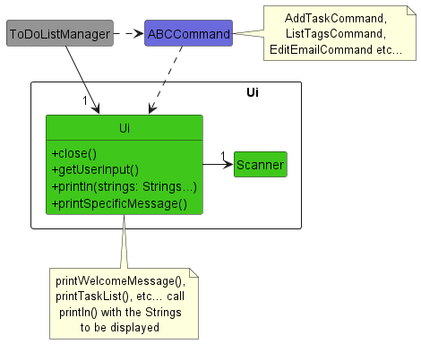
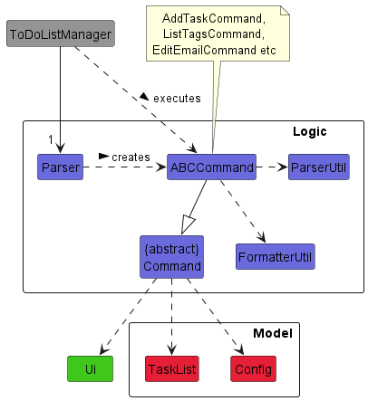
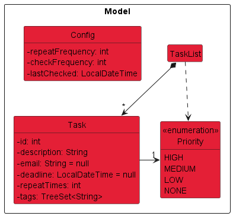
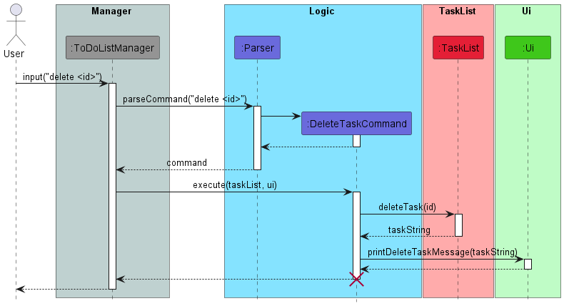
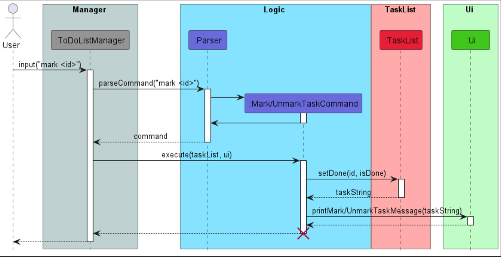
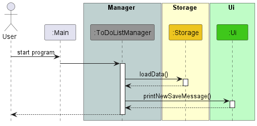
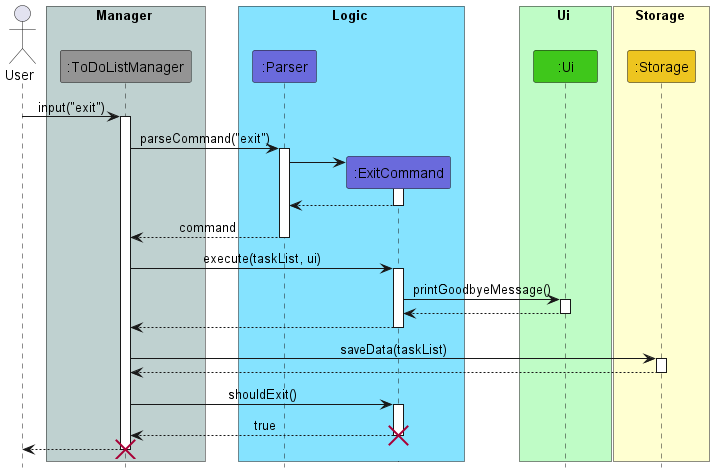
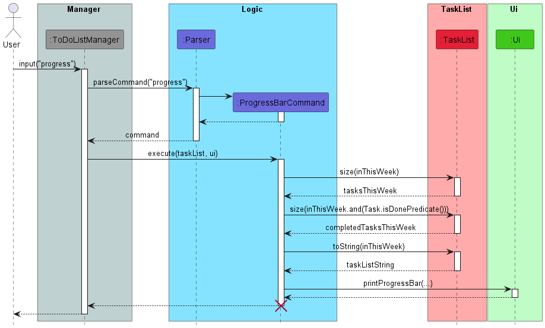

# Developer Guide

## Table of Contents

* Table of Contents
{:toc}

## Acknowledgements

Adapted from [AddressBook Level 3 Developer Guide](https://se-education.org/addressbook-level3/DeveloperGuide.html)

## Setup

### Setting up the project on your computer

First, **fork** this repo, and **clone** the fork into your computer.

If you plan to use Intellij IDEA (highly recommended):
1. **Configure the JDK**: Follow the guide [_[se-edu/guides] IDEA: Configuring the JDK_](https://se-education.org/guides/tutorials/intellijJdk.html) to ensure Intellij is configured to use **JDK 11**.
1. **Import the project as a Gradle project**: Follow the guide [_[se-edu/guides] IDEA: Importing a Gradle project_](https://se-education.org/guides/tutorials/intellijImportGradleProject.html) to import the project into IDEA. 
   - Note: Importing a Gradle project is slightly different from importing a normal Java project.
1. **Verify the setup**: Run `Main` and try a few commands.

## Design

> The `.puml` files used to create the diagrams in this guide can be found in the [diagrams](https://github.com/AY2223S2-CS2113-T11-4/tp/tree/master/docs/diagrams) folder.

### Architecture

The above diagram provides a high-level overview of the program's design, which consists of 5 main components.

- [`ToDoListManager`](#manager-component): Initializes the other components and connects them together
- [`UI`](#ui-component): Handles all input and output between the user and the program
- [`Logic`](#logic-component): Parses user input to commands and executes them
- [`TaskList`](#model-component): Holds the program's data in memory
- [`Storage`](#storage-component): Saves data to the hard disk and loads it during the program's startup

### Manager Component

The code for this component is found in [`ToDoListManager.java`](https://github.com/AY2223S2-CS2113-T11-4/tp/blob/master/src/main/java/seedu/todolist/ToDoListManager.java).

The `ToDoListManager` component contains the `Ui`, `Logic`, `Model`, and `Storage` components, and depends
on the `Command` class, which is returned by the `Parser` class and executed by the `ToDoListManager`.

The `ToDoListManager` component,
- initializes all the other components that it operates on (`Ui`, `Parser`, `Model`, `Storage`).
- passes user input from the `Ui` component to the `Logic` component, which returns a `Command` object.
- executes the returned `Command` object on the `Model` component, using the `Logic` component.
- calls on the `Storage` component to save the data of the `Model` component locally.

### Ui component

The code for this component is found in [`Ui.java`](https://github.com/AY2223S2-CS2113-T11-4/tp/blob/master/src/main/java/seedu/todolist/ui/Ui.java).

The `Ui` component consists of just the `Ui` class.

The `getUserInput()` method is used by the `ToDoListManager` to get the user's input, which is used to create a
`Command` object. Output from executing a `Command` is displayed using `println()`. When the program terminates, the
`ToDoListManager` will call `close()` to close the `Scanner`.

### Logic component

The code for this component is found [here](https://github.com/AY2223S2-CS2113-T11-4/tp/blob/master/src/main/java/seedu/todolist/logic).

The `Logic` component contains the `Parser`, `Command`, `ParserUtil`, and `FormatterUtil` classes, as well as
extensions of the `Command` class like the `AddTaskCommand`, `ListTagsCommand`, and `EditEmailCommand` subclasses.

When the `ToDoListManager` component passes user input to the `Parser`, a `Command` object (such as an
`AddTaskCommand`) is created and returned to the `ToDoListManager`. The `ToDoListManager` executes the returned
`Command` object, which will act on the `TaskList` and `Config` if needed and output the result of the command
through the `Ui` component.

### Model component

The code for this component is found in [here](https://github.com/AY2223S2-CS2113-T11-4/tp/blob/master/src/main/java/seedu/todolist/model).

The `Model` component contains the `Config`, `TaskList`, and `Task` classes, and the `Priority` enum.

The `Config` stores the attributes related to recurring tasks. The `TaskList` stores all `Task` objects in a `TreeMap`,
which it can operate on. The `Task` class consists of several attributes such as a description as well as a priority
level, which is represented as an enumeration `Priority`.

### Storage component

The code for this component is found in [`Storage.java`](https://github.com/AY2223S2-CS2113-T11-4/tp/blob/master/src/main/java/seedu/todolist/storage/Storage.java).

The Storage component can save the task list as TaskList objects in a .json file format using the GSON library and read 
it back into a TaskList object.

## Implementation

> The lifeline of the sequence diagrams in this section should end at the destroy marker (X), but due to a limitation of PlantUML, the lifeline reaches the end of the diagram.

### Delete task feature

The DeleteTaskCommand extends NUS To-Do List with a delete feature for the removal of tasks from the task list.
It is facilitated by ToDoListManager, Parser, exception, TaskList and Storage classes.
It implements the `TaskList#deleteTask()` operation.

Given below is an example usage scenario and how the DeleteTaskCommand mechanism behaves at each step.

Step 1: The user launches the program for the first time. The ToDoListManager will be initialised. This in turn will
then initialise the Parser, TaskList and Storage. Take it as there are no existing tasks read/stored by the program.

Step 2: The user executes `add survey -due 20/03/2023 23:59` command to add a task for the To-Do List.
The add command calls `TaskList#addTask()`, which causes a new Task to be added to the existing TaskList.

Step 3: The user now then decides that adding this task was a mistake, and decides to remove the task from the
To-Do List. The user does this by inputting the command `delete 1` into the terminal to delete a task in the task list.
The command will then call the `TaskList#deleteTask()`, which removes the task at id 1 of the TaskList.

The following sequence diagram shows how the delete task operation works:

### Mark/unmark task feature

Step 1: The user launches the program for the first time. The ToDoListManager will be initialised. This in turn will
then initialise the Parser, TaskList and Storage. Take it as there are no existing tasks read/stored by the program.

Step 2: The user executes `add survey -due 20/03/2023 23:59` command to add a task for the To-Do List.
The add command calls `TaskList#addTask()`, which causes a new Task to be added to the existing TaskList.

Step 3: The user wants to mark the task as completed by inputting the command `mark 1` into the terminal
to mark the task as done. The command will then call the `TaskList#setDone()`, which marks the task at id 1
of the TaskList as done.

For the unmark command, the user can instead input the command `unmark 1` to set the task as incomplete.
The command also calls `TaskList#setDone()` which sets the task at id 1 to be not done.

The following sequence diagram shows how the mark/unmark task operation works:

### Edit task deadline feature

The edit deadline function extends NUS To-Do List with an edit feature for the deadlines assigned to tasks.
It is facilitated by the TaskList and Command classes. It implements the `TaskList#setDeadline()` operation,
which edits deadline of task at assigned id.

Given below is an example usage scenario and how the edit deadline mechanism will behave at each step.

Step 1. The user launches the application for the first time. There are no existing tasks read by the program.

Step 2. The user executes `add survey -due 20/03/2023 23:59` command to add a task to the To-Do List.
The `add` command calls `TaskList#addTask()`, which causes a new Task to be added to the existing TaskList.

Step 3. The user has received an update about an extension to the deadline for the task, and decides to change
the deadline by executing the `edit 1 -due 25/03/2023 15:00` command. The `edit` will call `TaskList#setDeadline()`,
which updates the value of deadline for the Task item saved at id 1 to the new updated deadline.

The following sequence diagram shows how the edit operations works:

### Repeating tasks feature

The repeating tasks function extends NUS To-Do List allowing tasks to be listed as repeating for a certain number of
occurrences.
It is facilitated by the TaskList, Storage and Command classes. It implements the `TaskList#setRepeatTimes()` 
which sets the number of times the task is to repeat, and `TaskList#checkRepeatingTasks()` to check for tasks stored
in the TaskList for repeat settings.

Given below is an example usage scenario and how the repeating task mechanism will behave at each step.

Step 1. The user launches the application for the first time. There are no existing tasks read by the program.

Step 2. The user executes `add survey -due 20-03-2023 23:59 -rep 3` command to add a task to the To-Do List.
The `add` command calls `TaskList#addTask()`, which causes a new Task to be added to the existing TaskList.

Step 3. The user then exits the program with the saved TaskList.

Step 4. The user opens the program a week after the set deadline of the `survey` task. Since the configuration file is
still at default settings, it will check after every command is executed if any tasks in the TaskList have a repeat 
count of > 0 and is due for repeat after 1 week. Since the existing task fulfils the condition, a new task with the same
description `survey` will be created, with a deadline of 1 week from the original deadline appended to the 
task. (i.e `27-03-2023 23:59`). The repeat count of the original `survey` task will be changed to 0, whilst the new `survey`
task will have a repeat count of 2.

### List tasks sorted by deadline feature

This ListTasksCommand extends NUS To-Do List with an automatic sorting feature that sorts all tasks in an ascending
deadline order and displays the To-Do List to users. It is facilitated by the TaskList, Command class, and UI class.
It implements the `TaskList#toString()` and  `ui#printTaskList()`operation.

Given below is an example usage scenario and how the ListTasksCommand mechanism will behave at each step.

Step 1. The user launches the application for the first time. There are no existing tasks read by the program.

Step 2. The user executes `add survey -due 20/03/2023 12:00` and `add survey -due 21/03/2023 12:00` command to add 2
tasks to the To-Do List. The `add` command calls `TaskList#addTask()` once for each task, which causes 2 new Tasks to
be added to the existing TaskList.

Step 3. The user wants to view the entire list of deadlines that he/she has added. The user can do this by using the
command `list -sort due` into the terminal. By doing so,`TaskList#toString()` will be executed, which will sort
the list in an ascending deadline order, where the deadline that is closest to date will be at the top and the deadline
furthest to date will be at the bottom. Next, `ui#printTaskList()` will be executed, which will display the list of
deadlines to the user in the terminal.

The following sequence diagram shows how the list operation works:

### Storage feature

The storage feature is facilitated by the `Storage` class.

The Storage class implements the following operations:
- `Storage#save()` --- Saves the current task list.
- `Storage#loadData()` --- Loads a task list from the previously saved file, if there is one.

Given below are 3 example usage scenarios and how the Storage mechanism behaves in each scenario.

Scenario 1: The user launches the application and there is a valid save file found. Storage loads the file successfully
and informs the user of the loaded task list (and how many tasks there are in it).

Scenario 2: The user launches the application and there is no save file found. Storage informs the user that there is no
save file found and that a new one will be created for them later.

Scenario 3: The user edits the task list or exits the program. Storage saves the changes automatically into the save 
file. Note that the sequence diagram below shows what happens when the user exits the program, but the processes in
Storage occur even when the user performs other commands to edit the task list.

#### Design considerations:
- **Option 1**: Save task list as a self-formatted .txt file which can be printed and used as a physical task list.
    - Pros: Can get a physical task list to use.
    - Cons: Difficult to maintain as Storage class has to be updated whenever more fields are added to Task class. For
          example, if we add a "tag" field to Task, the formatting for the saved .txt file has to be updated to reflect
          that change.
- **Option 2**: Append rather than overwrite when saving the task list.
    - Pros: Will likely be able to save the task list much faster.
    - Cons: Difficult to implement, especially when considering the current mark task operation.
- **Option 3 (current choice)**: Save task list as a json file using the GSON library.
    - Pros: Easy to implement and easy to maintain as Storage class does not have to be updated whenever new fields are 
added to Task class. Do not need to consider whether we use append or overwrite when saving task list as it is 
irrelevant when using this implementation. The GSON library's pretty printing functionality makes the json file very 
easy to read for humans and understand which allows advanced users to easily modify the file for quick updating of their
task list.
    - Cons: Users have to download some dependencies to be able to use the GSON library.

Main reasons for choosing Alternative 3: It is much easier to implement and maintain than the other 2 alternatives,
and we found that the need to download dependencies to use the GSON library would not be a big issue.

### Progress Bar Feature
The ProgressBarCommand extends NUS To-Do List with a progress bar feature for tracking the progress on tasks in the task 
list that must be finished by the current week. It is facilitated by ToDoListManager, Parser, TaskList, TemporalField, 
LocalDate and Ui classes. It implements the `Ui#printProgressBar()` operation, which informs the user of their progress 
using a percentage (up to 2 decimal places) and a bar (where '=' denotes completion and '-' denotes incomplete).

Given below is an example usage scenario and how the ProgressBarCommand mechanism behaves in this scenario.

The user has a task list with 3 tasks that are due this week. Among the 3 tasks, 1 is marked as done. The user executes 
the progress command, which will call `Ui#printProgressBar()`. The user now sees that they have completed 33.33% of 
their tasks and a progress bar to help them visualize their progress.

In the above diagram `printProgressBar(completedTasksThisWeek, tasksThisWeek, PROGRESS_BAR_SECTIONS, taskListString)`
is abbreviated as `printProgressBar(...)`.

## Appendix: Requirements

### Product scope

#### Target user profile

Forgetful NUS students who used to rely on LumiNUS’s deadline reminders.

#### Value proposition

With the transition to Canvas, the most important feature of LumiNUS’s deadline reminders is gone! Our project aims to
bring an application to keep you aware of your deadlines and not miss them.

### User Stories

| Version | As a ... | I want to ...                                                                                                    | So that I can ...                                                         |
|---------|----------|------------------------------------------------------------------------------------------------------------------|---------------------------------------------------------------------------|
| v1.0    | user     | add tasks to my to-do list                                                                                       ||
| v1.0    | user     | add a time/deadline to a task                                                                                    | record when a task needs to be done                                       |
| v1.0    | user     | list all tasks by ascending date                                                                                 | view tasks that have an earlier deadline                                  |
| v1.0    | user     | remove tasks                                                                                                     | remove finished/wrong tasks                                               |
| v1.0    | user     | mark/unmark tasks                                                                                                | check off unfinished tasks                                                |
| v1.0    | user     | edit the time/deadline of existing tasks                                                                         | update tasks with changed deadlines (postponed/brought forward)           |
| v2.0    | student  | add tags/module codes to each task                                                                               | group related tasks together                                              |
| v2.0    | student  | set reminders at the start of the day                                                                            | do not forget what I have to achieve by the end of the day/week           |
| v2.0    | user     | list all the tasks in chronological order/grouped by module code/grouped by type of work (individual/group work) | have a “birds’ eye view” of all my tasks. (i.e different sorting methods) |
| v2.0    | user     | filter the tasks by their properties (description, deadline, tags, …)                                            | find them easily                                                          |
| v2.0    | user     | view the tasks in a calendar view                                                                                | view them in a summarised layout                                          |
| v2.0    | user     | add the email of the professor/TA in charge of the task                                                          | can email them to clarify if needed                                       |
| v2.0    | user     | attach a list of files/links to refer to                                                                         | know where the materials I can refer to are                               |
| v2.0    | user     | set a task to repeat                                                                                             | create 1 task to represent repeating tasks every week                     |
| v2.0    | user     | set priority level and can sort the tasks based on the priority level                                            | identify high priority tasks                                              |
| v2.0    | user     | see a progress bar                                                                                               | track my progress of unfinished tasks                                     |
| v2.1    | user     | customise some of the repeating settings                                                                         | reduce my system usage and repeat my tasks at a more suitable frequency   |

### Non-Functional Requirements

1. Should work on any mainstream OS assuming it has Java 11 or above installed.
2. A user with above average typing speed for regular English text (i.e. not code, not system admin commands) should be 
able to accomplish most of the tasks faster using commands than using the mouse.

## Instructions for manual testing

The following are instructions on how to test the program manually.

- After downloading the jar file from [here](https://github.com/AY2223S2-CS2113-T11-4/tp/releases/tag/v2.0), run `java -jar todolist.jar` in a terminal to start the program.
  - Expected: The startup, save loading and startup reminder messages will be displayed in the terminal.
- Try running some commands - use the command `help` or refer to the [User Guide](https://ay2223s2-cs2113-t11-4.github.io/tp/UserGuide.html) for a list of commands.
- To exit, use the command: `exit`
  - Expected: The exit message is displayed in the terminal and the program exits, returning control to the terminal.
